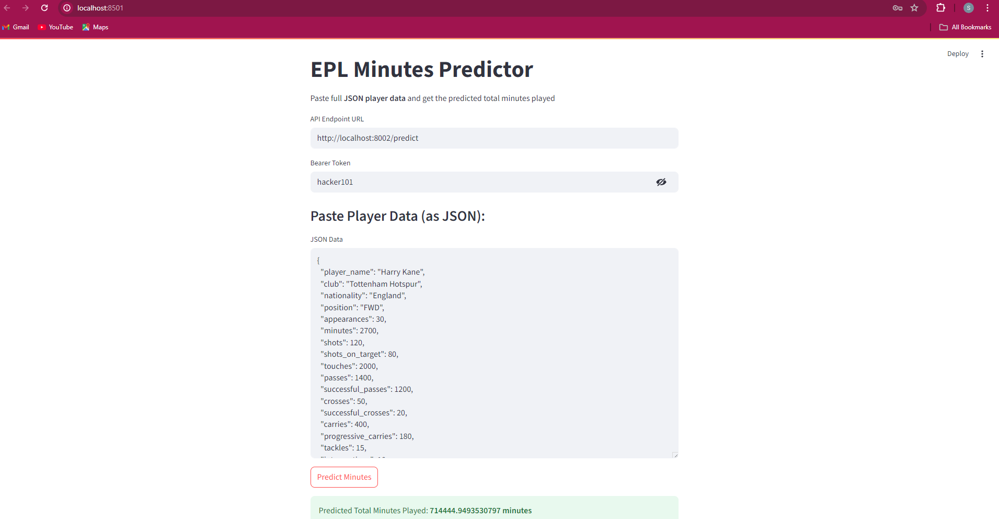

# ⚽ EPL Minutes Predictor – Fullstack Regression App

This is a simple but complete **fullstack machine learning application** that predicts the **total minutes played** by an English Premier League (EPL) player based on match stats using a regression model.

It demonstrates my skills in:
- 🔧 Building secure **FastAPI** backends
- 🎯 Developing and deploying **regression models**
- 🌐 Creating interactive **Streamlit frontends**
- 🔐 Implementing **token-based authentication**
- 🚀 Building and wiring up a **secure, production-ready fullstack ML pipeline**
- 🐳 Containerizing the backend with **Docker** for easy deployment and scalability

---

## 📸 Demo

 <!-- Optional if you include a screenshot -->

---

## 🔍 Use Case

You input detailed season stats for a player (shots, touches, passes, etc.), and the app predicts how many minutes that player is likely to have played based on similar historical data.

Useful for:
- ⚽ Football analytics
- 🧠 ML regression practice
- 🧪 Demonstrating a fullstack AI pipeline
- 🔐 Token-secured model deployments

---

## 🧩 Tech Stack

| Layer       | Tools Used                 |
|-------------|----------------------------|
| **Frontend**  | Streamlit                 |
| **Backend**   | FastAPI, Uvicorn, Docker  |
| **Modeling**  | Scikit-learn (or similar) |
| **Auth**      | Bearer Token Auth         |
| **Comms**     | JSON over HTTPS (via `requests`) |

---

## 🔐 Security

- All API endpoints are protected using **Bearer Token Authentication**.
- Only authorized users can access the prediction service.

---

## 🚦 How It Works

1. User opens the **Streamlit app**.  
2. Enters player data manually or pastes a full JSON dictionary.  
3. Provides the API endpoint and token.  
4. Streamlit sends a POST request to the **FastAPI backend**.  
5. FastAPI validates the token and data, runs the regression model, and returns the predicted minutes.  
6. Streamlit displays the result beautifully and clearly.

---

## ⚙️ Installation & Running

### Backend (FastAPI with Docker)

Build and run the backend container:

```bash
cd backend
docker build -t epl-minutes-backend .
docker run -d -p 8000:8000 epl-minutes-backend
````

The backend will be available at `http://localhost:8000`.

### Frontend (Streamlit)

```bash
cd frontend
pip install -r requirements.txt
streamlit run app.py
```

---

## 🛡️ Example Token Usage

```http
POST /predict
Authorization: Bearer YOUR_TOKEN
Content-Type: application/json
```

---

## 📈 Model

* Trained using a dataset of EPL players and season-level stats.
* Regression-based model (e.g. LinearRegression or XGBoostRegressor).
* Target variable: `total_minutes_played`.

---

## 🚀 Future Work

* Containerize frontend and orchestrate with Docker Compose
* Add CI/CD and deployment via Fly.io or Render
* Add real-time data scraping
* Swap to OAuth2 or JWT for scalable auth

---

## 👨‍💻 About Me

This project demonstrates my **end-to-end ML application skills**, from data ingestion and model training to secure API development and interactive UIs.

If you're hiring or collaborating, this is just one example of my practical AI engineering work.

---

## 📬 Contact

* GitHub: [username](https://github.com/stee1011)

